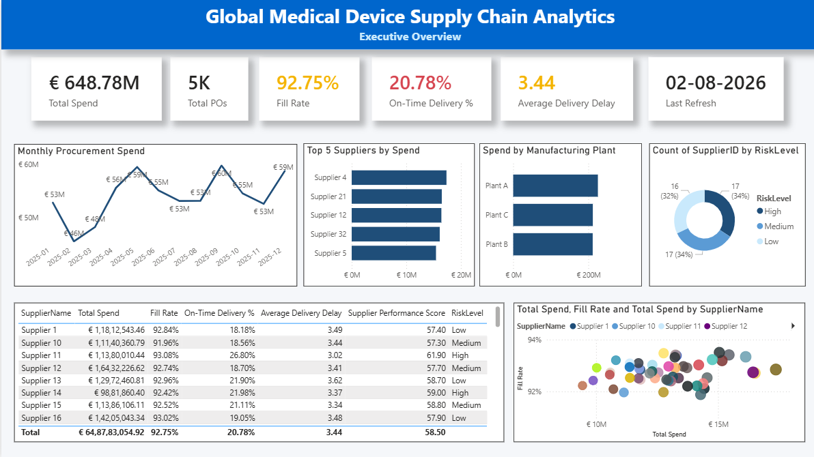
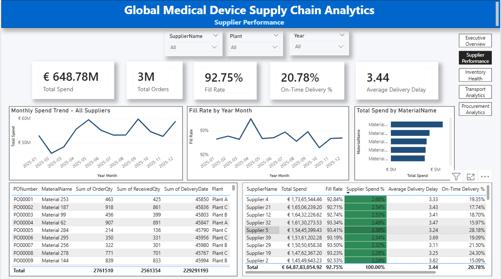
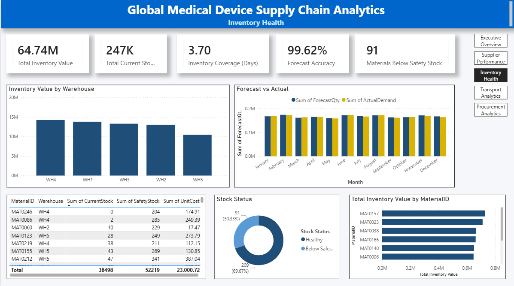
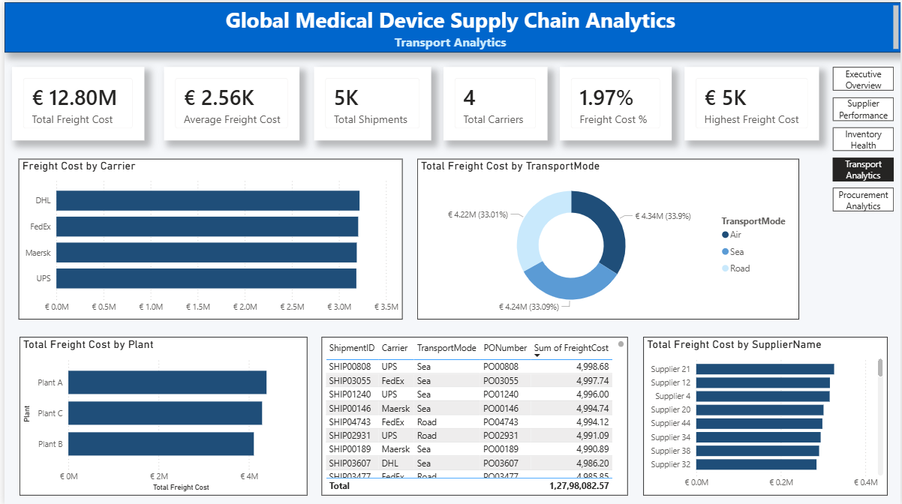
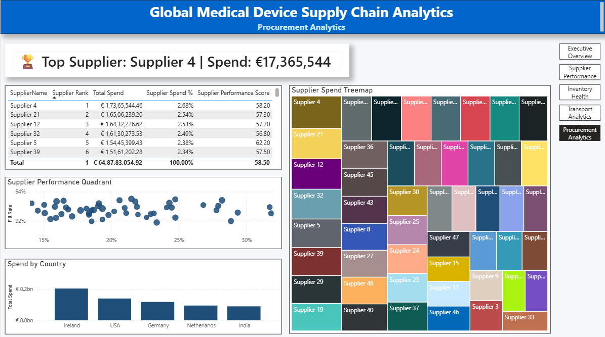

# 📊 Supply Chain Analytics Dashboard

An end-to-end Business Intelligence solution built in **Microsoft Power BI** to analyze procurement, supplier performance, inventory health, demand forecasting, and transportation operations for a global medical device manufacturing company.

---

# 📌 Project Overview

This project demonstrates the development of a complete Supply Chain Analytics solution using Power BI. The dashboard transforms raw operational data into interactive business insights that support procurement managers, supply chain analysts, and business leaders in making informed decisions.

The solution follows a star schema data model and uses DAX measures, Power Query transformations, and interactive visualizations to monitor key supply chain metrics.

---

# 🎯 Business Objectives

This dashboard was designed to answer questions such as:

- Which suppliers account for the highest procurement spend?
- How well are suppliers performing?
- Which materials require replenishment?
- How accurate is demand forecasting?
- Which transportation modes generate the highest freight costs?
- Where should management focus operational improvements?

---

# 📈 Dashboard Pages

## 🏠 Landing Page

Provides an entry point into the report with navigation buttons to each analytical dashboard.

---

## 📊 Executive Overview

High-level summary of supply chain performance including:

- Total Procurement Spend
- Total Purchase Orders
- Average Fill Rate
- On-Time Delivery
- Freight Cost
- Executive KPI Summary

---

## 🏭 Supplier Performance

Evaluates supplier performance using metrics such as:

- Procurement Spend
- Supplier Spend %
- Fill Rate
- On-Time Delivery %
- Average Delivery Delay
- Supplier Performance Score

Includes supplier ranking and executive insights.

---

## 📦 Inventory Health

Monitors inventory across warehouses including:

- Inventory Value
- Stock Status
- Safety Stock Analysis
- Forecast vs Actual Demand
- Warehouse Inventory Distribution

---

## 🚚 Transportation Analytics

Provides visibility into logistics performance through:

- Freight Cost by Transport Mode
- Shipment Distribution
- Carrier Performance
- Freight Cost Analysis

---

## 📊 Procurement Analytics

Advanced procurement insights including:

- Supplier Ranking
- Executive Insight Card
- Supplier Spend Treemap
- Procurement Spend by Country
- Supplier Performance Scatter Analysis

---

# 📊 Key Performance Indicators (KPIs)

| KPI | Business Purpose |
|------|------------------|
| Total Spend | Total procurement expenditure |
| Total Purchase Orders | Procurement activity volume |
| Fill Rate | Supplier order fulfilment performance |
| On-Time Delivery | Supplier delivery reliability |
| Average Delivery Delay | Measures supplier delays |
| Supplier Spend % | Supplier dependency analysis |
| Performance Score | Overall supplier evaluation |
| Inventory Value | Total inventory investment |
| Forecast Accuracy | Demand planning effectiveness |
| Freight Cost | Transportation expenditure |

---

# 🗂️ Data Model

The dashboard follows a **Star Schema** design.

Fact Tables

- Purchase Orders
- Inventory
- Shipments
- Demand Forecast

Dimension Tables

- Supplier Master
- Material Master

Relationships were created using primary and foreign keys to ensure efficient filtering and reporting.

---

# 🛠️ Technology Stack

- Microsoft Power BI
- Power Query
- DAX (Data Analysis Expressions)
- Data Modeling
- Excel / CSV
- Star Schema Design

---

# 📁 Repository Structure

```
Supply-Chain-Analytics-PowerBI
│
├── Dashboard
│   └── Supply_Chain_Analytics.pbix
│
├── Data
│   ├── Purchase_Orders.csv
│   ├── Supplier_Master.csv
│   ├── Material_Master.csv
│   ├── Inventory.csv
│   ├── Demand_Forecast.csv
│   └── Shipments.csv
│
├── Images
│
├── LICENSE
└── README.md
```

---

## 📷 Dashboard Screenshots

### Executive Overview



### Supplier Performance



### Inventory Health



### Transportation Analytics



### Procurement Analytics




### Dashboard Pages

- Landing Page
- Executive Overview
- Supplier Performance
- Inventory Health
- Transportation Analytics
- Procurement Analytics

---

# 💡 Business Insights Generated

This dashboard enables decision-makers to:

- Identify high-spend suppliers
- Monitor supplier reliability
- Detect inventory shortages
- Compare forecast against actual demand
- Analyse logistics costs
- Evaluate procurement performance
- Support data-driven operational decisions

---

# 🚀 Skills Demonstrated

This project demonstrates practical experience with:

- Data Cleaning
- Data Modelling
- Star Schema Design
- DAX Measures
- KPI Development
- Interactive Dashboard Design
- Business Intelligence Reporting
- Supply Chain Analytics
- Procurement Analytics
- Inventory Analysis
- Logistics Analytics

---

# 🔮 Future Enhancements

Potential improvements include:

- Time Intelligence (YTD, MTD, YoY)
- Dynamic Top N Analysis
- Pareto (80/20) Analysis
- Row-Level Security (RLS)
- Automated Data Refresh
- Power BI Service Deployment

---

# 👤 Author

**Avinash Kamath**

GitHub: **buildsofavi**

---

## ⭐ If you found this project interesting, feel free to explore the repository and connect with me.
