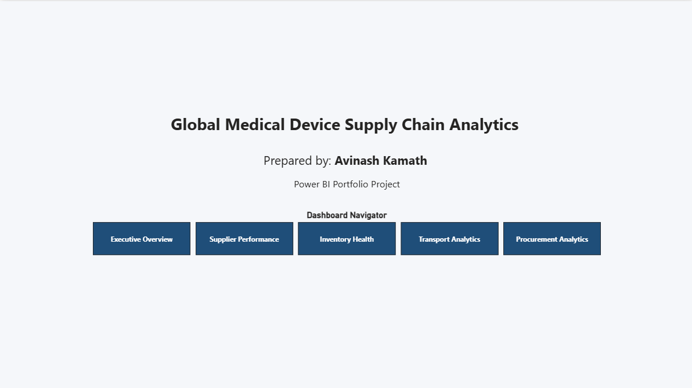

# 📊 Supply Chain Analytics Dashboard

An end-to-end Business Intelligence solution built using **Microsoft Power BI** to analyze procurement, supplier performance, inventory health, demand planning, and transportation operations for a **simulated global medical device manufacturing company**.

This project demonstrates practical skills in **data modeling, DAX, dashboard development, and business analytics**, with complete project documentation included.

---

# 📌 Project Overview

Organizations generate vast amounts of supply chain data across procurement, inventory, logistics, and supplier operations. Without centralized reporting, business users often rely on multiple spreadsheets and disconnected reports, making decision-making slow and reactive.

This project consolidates multiple operational datasets into a single interactive Power BI solution that enables users to monitor key performance indicators and make data-driven decisions.

---

# 🎯 Business Problem

The dashboard was designed to answer key business questions across the supply chain.

## Procurement

- How much did we spend this year?
- Which supplier received the highest spend?
- Which plant purchases the most?
- Which buyer manages the most purchase orders?
- What is the monthly procurement trend?

## Supplier Performance

- Which supplier delivers late?
- Which supplier has the lowest Fill Rate?
- What is the average delivery delay?
- How do suppliers rank overall?

## Inventory

- What is the current inventory value?
- Which materials are below Safety Stock?
- Which materials are overstocked?
- How is inventory distributed across warehouses?

## Demand Planning

- What is the forecast accuracy?
- Which materials have the largest forecast errors?
- What is the monthly demand trend?

## Logistics

- What is the freight cost by carrier?
- What is the freight cost by transport mode?
- What is the average freight cost per shipment?

---

# 💡 Solution

The solution integrates procurement, supplier, inventory, demand planning, and logistics data into a centralized Power BI dashboard.

The report follows a **Star Schema** data model and leverages **Power Query** for data transformation and **DAX** for KPI calculations, enabling interactive analysis through slicers, KPI cards, trend charts, matrices, and executive insights.

---

# 📊 Dashboard Pages

## 🏠 Landing Page

Navigation page providing quick access to each dashboard.

---

## 📈 Executive Overview

High-level overview of supply chain performance including:

- Total Procurement Spend
- Purchase Orders
- Fill Rate
- On-Time Delivery
- Delivery Delay
- Executive KPI Summary

---

## 🏭 Supplier Performance

Analyzes supplier efficiency using:

- Supplier Spend %
- Fill Rate
- On-Time Delivery %
- Delivery Delay
- Supplier Performance Score
- Supplier Ranking

---

## 📦 Inventory Health

Monitors inventory across warehouses:

- Inventory Value
- Stock Status
- Materials Below Safety Stock
- Warehouse Distribution
- Forecast vs Actual Demand

---

## 🚚 Transportation Analytics

Provides logistics insights including:

- Freight Cost by Carrier
- Freight Cost by Transport Mode
- Shipment Distribution
- Average Freight Cost

---

## 📊 Procurement Analytics

Procurement-focused analysis featuring:

- Supplier Spend
- Procurement Trends
- Supplier Concentration
- Executive Insight Card
- Supplier Performance Matrix

---

# 📷 Dashboard Screenshots

## Landing Page



---

## Executive Overview


---

## Supplier Performance


---

## Inventory Health


---

## Transportation Analytics


---

## Procurement Analytics


---

# 📊 Key Performance Indicators

- Total Spend
- Total Purchase Orders
- Fill Rate
- On-Time Delivery %
- Average Delivery Delay
- Supplier Spend %
- Supplier Performance Score
- Inventory Value
- Forecast Accuracy
- Total Freight Cost
- Average Freight Cost
- Cost per Shipment

---

# 🛠️ Technology Stack

- Microsoft Power BI
- Power Query
- DAX (Data Analysis Expressions)
- Data Modeling
- Star Schema Design
- Excel / CSV
- GitHub

---

# 🗂️ Data Model

The solution follows a **Star Schema** design consisting of:

### Fact Tables

- Purchase Orders
- Inventory
- Demand Forecast
- Shipments

### Dimension Tables

- Supplier Master
- Material Master

The model enables efficient filtering, simplified reporting, and scalable dashboard development.

---

# 📁 Repository Structure

```text
Supply-Chain-Analytics-PowerBI
│
├── Dashboard
│   └── Supply_Chain_Analytics.pbix
│
├── Data
│   ├── Purchase_Orders.csv
│   ├── Supplier_Master.csv
│   ├── Material_Master.csv
│   ├── Inventory.csv
│   ├── Demand_Forecast.csv
│   └── Shipments.csv
│
├── Documentation
│   ├── Business_Case.pdf
│   ├── Problem_Solution_Document.pdf
│   └── Supply_Chain_Analytics_Project_Documentation.xlsx
│
├── Images
│   ├── Landing_Page.png
│   ├── Executive_Overview.png
│   ├── Supplier_Performance.png
│   ├── Inventory_Health.png
│   ├── Transportation_Analytics.png
│   └── Procurement_Analytics.png
│
├── LICENSE
└── README.md
```

---

# 📚 Project Documentation

The repository includes detailed project documentation:

- 📄 Business Case
- 📄 Problem & Solution Document
- 📊 Project Documentation Workbook

The documentation workbook contains:

- Project Overview
- Data Dictionary
- Relationship Documentation
- DAX Library
- KPI Catalog
- Dashboard Pages

These documents describe the business context, data model, KPIs, DAX measures, and dashboard design decisions.

---

# 🚀 Skills Demonstrated

- Business Intelligence
- Data Modeling
- Star Schema Design
- Power Query
- DAX Measures
- KPI Development
- Dashboard Design
- Executive Reporting
- Procurement Analytics
- Supplier Performance Analysis
- Inventory Analytics
- Demand Planning Analytics
- Transportation Analytics
- Data Visualization
- GitHub Documentation

---

# 🔮 Future Enhancements

Potential improvements include:

- Time Intelligence (YTD, MTD, QoQ, YoY)
- Dynamic Top N Analysis
- Pareto (80/20) Supplier Analysis
- Row-Level Security (RLS)
- Power BI Service Deployment
- Automated Data Refresh
- Supplier Risk Prediction
- Predictive Inventory Planning

---

# 👤 Author

**Avinash Kamath**

📍 MSc Automotive Engineering – Loughborough University

🔗 GitHub: **buildsofavi**

---

## Disclaimer

This project was developed as a personal portfolio project using a **simulated supply chain dataset**. The business scenario is inspired by real-world supply chain operations in the medical device manufacturing industry and is intended solely to demonstrate Business Intelligence, data modeling, and Power BI dashboard development skills.
